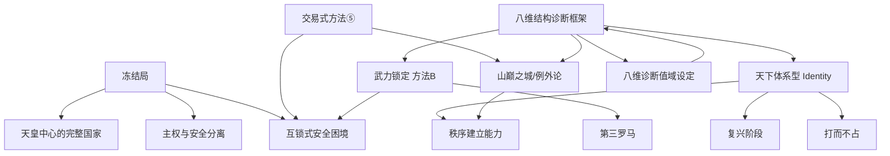

# ConStruct Lab — 结构词典索引

> 概念是分析的工具，不是分析的终点。每个条目都是一把解剖刀，不是一块石碑。

---

## 按主题分类

### Identity 类（身份型概念）

| 概念 | 核心定义 | 代表主体 | 状态 |
|------|----------|----------|------|
| 天下体系型 Identity | 以中国为中心的文明秩序，秩序建立能力是 Identity 核心 | 中国 | 稳定 |
| 山巅之城 / 例外论 | 美国作为制度实验的普世性，Identity 绑在"世界灯塔"锚点上 | 美国 | 稳定 |
| 第三罗马 | 俄罗斯作为正统文明继承者，核心恐惧是被降级为"非帝国" | 俄罗斯 | 稳定 |
| 天皇中心的完整国家 | 日本以天皇为核心的主权完整性，战后"主权与安全分离"模式 | 日本 | 稳定 |

### 方法阶段类（Method 类概念）

| 概念 | 核心定义 | 代表主体 | 状态 |
|------|----------|----------|------|
| 冻结局 (Frozen Settlement) | 以主权让渡换取安全保证的制度均衡——冻结局是方法，不是 Identity | 日本、韩国、台湾 | 稳定 |
| 交易式方法⑤ | 以退出威胁获取单边收益，利益对齐=关系存在，利益消失=结构切换 | 美国 | 稳定 |
| 武力锁定 方法B | 以军事力量为合法性终极来源，武力是身份表达而非工具 | 俄罗斯 | 稳定 |
| 复兴阶段（方法⑦） | 以恢复历史地位为目标的过渡期，scope 随复兴进度递增 | 中国 | 演进中 |

### 行为模式类（行为型概念）

| 概念 | 核心定义 | 代表主体 | 状态 |
|------|----------|----------|------|
| 打而不占 | 军事胜利后主动撤军，不要求领土。目标不是占领，是恢复秩序基线 | 中国（1962、1979） | 稳定 |
| 无对手的对抗 | 内驱型武力展示，不依赖外部挑衅。对手为 None，不是因为没有对手 | 俄罗斯 | 演进中 |
| 主权与安全分离 | 行政权与军事权分离的治理模式（如冲绳模式） | 日本 | 稳定 |

### 结构关系类

| 概念 | 核心定义 | 代表关系 | 状态 |
|------|----------|----------|------|
| 互锁式安全困境 | A 的安全措施自动构成 B 的威胁，双方都被对方的身份需求锁定 | 伊朗-以色列、印度-巴基斯坦 | 稳定 |
| 秩序建立能力 (OBC) | 主体塑造秩序而不依赖暴力的能力——天下体系型 Identity 的核心衡量标准 | 中国、美国 | 演进中 |

### 度量框架类（Diagnostic Framework）

| 概念 | 核心定义 | 覆盖层 | 状态 |
|------|----------|--------|------|
| 八维结构诊断框架 | 国别雷达的八维（L2/L3/L5/L6/L7/L8/L9/L10），值来自构型对照矩阵序数编码 | 跨层 | 稳定 |
| 八维诊断值域设定 | 九量表的完整定义与匹配规则，雷达值的序数编码机制 | 度量机制 | 稳定 |

---

## 概念网络图

---

## 统计

- **总条目**: 15
- **稳定**: 11 | **演进中**: 4 | **待验证**: 0

*结构词典是活的。每份新的国别诊断、事件快评、情景推演都可能催生新概念，或修正已有概念。*
